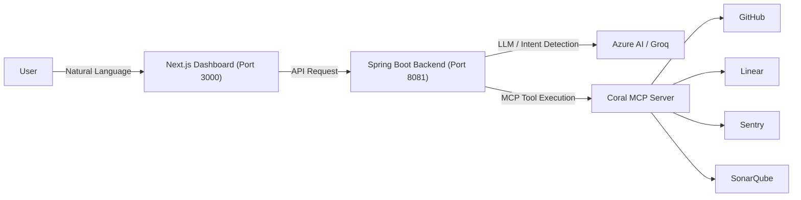

# CoralOps - Enterprise Agent


CoralOps is an Enterprise Intelligence Agent that leverages the power of [Coral](https://withcoral.com) federated SQL and Spring AI to provide a unified, natural language interface over your engineering and operational data sources.

Instead of navigating through multiple fragmented dashboards, CoralOps allows you to ask complex, cross-platform questions and instantly receive data-driven insights through an intuitive Next.js dashboard.

## 🌟 Key Features

- **Unified Intelligence Agent:** Ask natural language questions like *"What is the test coverage?"* or *"Discover the schemas for GitHub and Linear and join them"*.
- **Federated SQL via Coral:** Connects to GitHub, Linear, Sentry, and SonarQube simultaneously using Coral's MCP (Model Context Protocol) Server.
- **Dynamic Dashboard:** A beautiful, responsive Next.js frontend built with Tailwind CSS that displays data in rich markdown tables and charts.
- **Spring AI Backend:** A robust Spring Boot backend powered by Azure AI / OpenAI (e.g., LLaMA-3, Phi-4) orchestrating MCP tool calls and intent detection.
- **Fast-Path SQL Routing:** Common metric inquiries bypass the LLM entirely with zero-latency pre-compiled SQL, seamlessly falling back to the LLM for complex, multi-hop reasoning.

## 🏗️ Architecture



## 🚀 Getting Started

### Prerequisites

- Java 17+
- Node.js 18+
- [Coral CLI](https://withcoral.com) installed (`coral source add github`, etc.)
- Maven (`./mvnw`)

### 1. Environment Setup

Configure your API keys in the backend `.env` or `application.properties`:
```properties
GROQ_API_KEY=your_groq_api_key
GITHUB_PAT=your_github_token
LINEAR_API_KEY=your_linear_key
SENTRY_AUTH_TOKEN=your_sentry_token
SONARQUBE_API_KEY=your_sonarqube_token
```

### 2. Start the Backend

Navigate to the `backend` directory and start the Spring Boot server (runs on port `8081`):

```bash
cd backend
./mvnw spring-boot:run
```

### 3. Start the Frontend

Navigate to the `frontend` directory and start the Next.js development server (runs on port `3000`):

```bash
cd frontend
npm install
npm run dev
```

Visit `http://localhost:3000` in your browser to access the CoralOps Dashboard.

## 💡 Example Queries

Try asking the agent these questions in the dashboard:
- *"Give me a full summary of the project"*
- *"What is the quality gate status?"*
- *"List the bugs"*
- *"Show me recent Sentry issues"*
- *"Discover the schemas for GitHub and Linear, then write a SQL JOIN query connecting a GitHub PR to a Linear issue"*

## 🛠️ Technology Stack

- **Frontend:** Next.js, React, Tailwind CSS, Framer Motion, Lucide Icons
- **Backend:** Java 17, Spring Boot 3.4, Spring AI
- **AI / LLM:** OpenAI-compatible APIs (Groq, Azure AI)
- **Data Integration:** [Coral](https://withcoral.com) (MCP Server & Federated SQL)

## 📄 License

This project is licensed under the Apache License 2.0.
